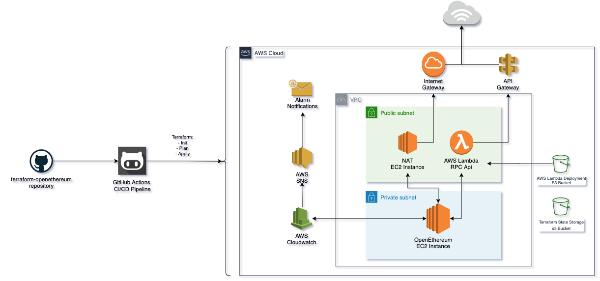
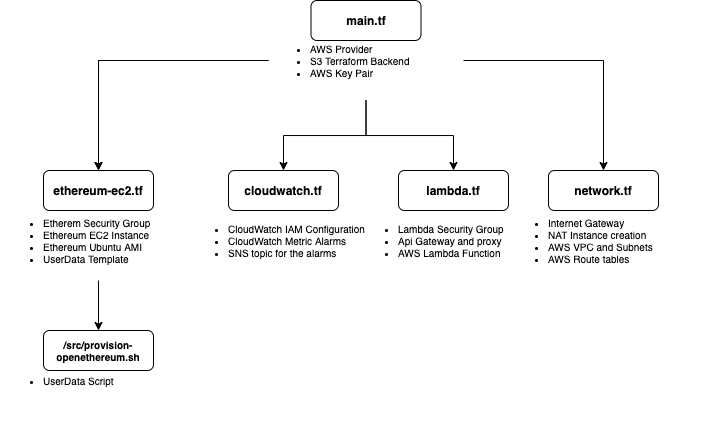

<h1 align="center"><code>Terraform OpenEthereum</code></h1>

  Created by <a href="https://github.com/Gustavobelfort">Gustavo Belfort</a>

<a href="#">Terraform OpenEthereum</a> is a repository to deploy a openethereum containerized infrastructure on aws

## Features
* AWS SNS Notification alerts via email
* OpenEthereum node running containerized inside the VM
* AWS Lambda integration api to consume RPC from the node
* GitHub Actions Pipeline to deploy into AWS using a GitFlow workflow approach
* Node running on a private subnet within the VPC to ensure security

## Why?

To ease the deployment of a OpenEthereum node on AWS Cloud Infrastructure !

## How it works

We use terraform triggered in a GitHub Actions CI/CD Pipeline to Deploy and update the infrastructure running on AWS

We rely on the use of GitHub Secrets in order to make the connection with AWS Api

This deployment also features a <a href="https://github.com/Gustavobelfort/openethereum-lambda">second repository</a> with a built in pipeline to deploy automatically changes into the AWS Lambda RPC Api Function

## General flow:

1. Create a new Branch following GitFlow recommendations
    - Work on the new feature/update/bugfix
2. Create a Pull Request into master:
    - The Terraform Plan Pipeline is triggered
    - We run a security check on the terraform repository using <a href="https://github.com/liamg/tfsec">tfsec</a>
    - We run the terrafom init
    - We run terraform plan
    - If everything succeeds we comment the output of terraform plan into the Github Pull request to ease the avaliation of an Admin
3. Admin merges the PR it into master:
    - The Terraform Apply Pipeline is triggered
    - We run terraform init
    - We run terraform apply
    - We store the state into the S3 Bucket inside AWS

## File Structure

The repository file structure and resources each file manages is as follow:

## Running locally
This repository is not planned to be run locally but you can do so by:

1.  <a href="https://learn.hashicorp.com/terraform/getting-started/install.html">Installing terraform</a>
2. Storing your personal private and public ssh keys into the `ssh_pubkey` and `ssh_privkey` env vars
3. Issuing:
        - `terraform init`
        - `terraform plan`
        - `terraform apply -input=false -auto-approve -var="ssh_pubkey=${ssh_pubkey}" -var="ssh_privkey=${ssh_privkey}"`

## Contributors

- Gustavo Belfort <a href="https://github.com/Gustavobelfort">(Gustavobelfort)</a>

Feel free to open a PR or create an issue if you'd like to improve the project!
